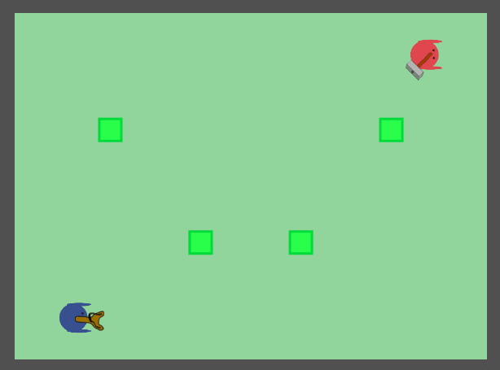

# Wondershot Phaser Experiment

I started this project in 2016 after playing the video game [Wondershot](https://store.steampowered.com/app/430190/Wondershot/) from [Leikir Studio](https://www.leikir-studio.com/).
My goal was to implement the game logic using the JavaScript framework [Phaser](https://phaser.io/), not the graphics!

In december 2022, the project was migrated to Phaser 3.55, TypeScript and Vite.
It should not receive any further updates as I have lost interest in Phaser. :no_mouth:




## Demo

[Demo](https://wondershot.totakoko.com/)

The game supports Xbox 360 gamepads:
- Left stick: move
- A: fire the weapon (keep pressed to charge your attack)
- B: jump
- Y: drop the weapon
- Start: pause

2 weapons are implemented, the hammer and the slingshot.


## Improvement ideas

- Better handle collision groups
- Better handle cameras
- Implement the final score board
- Implement other weapons
- Graphics, animations
- So much more...


## Docker image

To build and push to the [Docker Hub](https://hub.docker.com/).
```sh
docker build -t totakoko/wondershot-phaser-experiment .
docker push totakoko/wondershot-phaser-experiment
```
